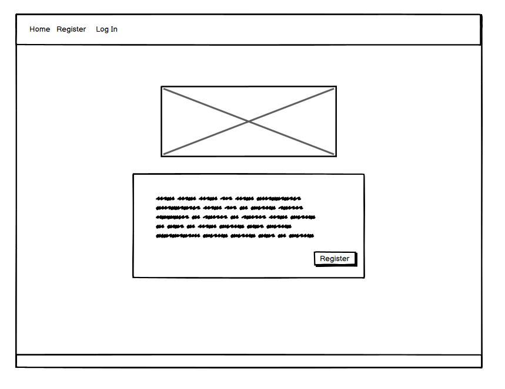

# love.exe

[Link to deployed site](https://cirrusmatch-46cf2d377c0d.herokuapp.com)

## Contents

## Introduction

This project aims to produce an inclusive, dating-style website, where users are encouraged to meet based on hobbies and interests, rather than based on the visual aspect of how a potential match may look. Achieving this by ensuring that other users photos are blurred out until they have successfully passed any dealbreakers that user may have set.

## User Experience

### User Stories

- As a user, I want to be able to create an account and set my preferences, including my hobbies/interests, dealbreakers and upload a profile picture
- As a user, I don't want people to be able to send me messages if they have any of my dealbreakers
- As a user, I want to be able to search for potential matches
- As a user, I want to be able to filter the potential matches based on hobbies
- As a user, I want to be able to communicate with potential matches

### Strategy

#### Agile

We chose to work in sprints, encouraging an agile development pipeline, where we are able to quickly adjust and respond to challenges in the development and address any issues that may occur in a fast and efficient manner.

#### MoSCoW

We used a github project board - allowing for the use of a MoSCoW prioritisation. This allowed us to keep foccused on the tasks that were required for the projects, ensuring a timely development timeline in keeping delivering a functioning project whilst working in defined sprints.

### Scope

We wanted to create an inclusive website for matching people with desired interests and hobbies - while taking into account each users individual dealbreakers. To achieve this approach we decided that the photo of other users will be blurred until you have successfully passed the dealbreaker questions for another user - allowing for matches to be based more heavily on hobby and interest compatibilities and reducing the superficial nature matching people based solely on photos.

#### Project Setup

The project was setup to use Django and Django-environ, also utilising a .env file where environment variables can be stored, which was added to the .gitignore to ensure that sensitive information is kept private

```bash
pip install Django
pip install django-environ
pip freeze > requirements.txt
django-admin startproject matching_project.
web: gunicorn matching_project.wsgi --chdir matching_project
```

#### .env setup

```text
SECRET_KEY=`Sanitised_Key`
DEBUG=True
```

#### Entity Relationship Diagrams

```plaintext
+-----------------+       +-----------------+       +-----------------+
|    CustomUser   |       |   UserProfile   |       |     Message     |
+-----------------+       +-----------------+       +-----------------+
| - id            |<----->| - user_id       |       | - id            |
| - username      |       | - bio           |       | - sender_id     |
| - email         |       | - profile_pic   |       | - recipient_id  |
| - password      |       | - age           |       | - content       |
+-----------------+       | - city_id       |       | - sent_at       |
                          | - country_id    |       | - read_at       |
                          | - created_at    |       +-----------------+
                          | - updated_at    |
                          +-----------------+
                                 ^
                                 |
                                 |
                          +-----------------+
                          |     Hobby       |
                          +-----------------+
                          | - id            |
                          | - name          |
                          +-----------------+

+-----------------+       +-----------------+       +-----------------+
| DealbreakerQues |       | DealbreakerAns  |       |   LikeDislike   |
+-----------------+       +-----------------+       +-----------------+
| - id            |<----->| - user_profile  |       | - id            |
| - text          |       | - question_id   |       | - user_id       |
| - question_type |       | - answer_yn     |       | - content_type  |
| - creator_id    |       +-----------------+       | - object_id     |
+-----------------+                                 | - content_object|
                                                    | - like          |
                                                    +-----------------+
```

### Wireframes

#### Landing Page



#### Register Page


#### Login Page


#### Edit Profile Page


#### Search Page


## Design

### Colour Scheme

We chose to go with a red, yellow and white colour scheme, keeping the pages light and inviting.

<!-- ### Imagery

As the project is run on heroku using eco dynos, any user uploaded images will be ephemeral, due to this we have linked the location of images to cloudinary -->

### Typography
We used fonts found on google fonts for the project, opting to choose for inviting, easy to read fonts to welcome people into using our site - and de-cloud the dating game to find their ideal match!

## Technologies Used

### HTML Language

HTML is the basis of all web pages - this was utilised to create code for which the users browser can interpret to display the desired pages to the user.

### CSS Styling

CSS was used to add styling to the project - this includes both bootstrap CSS as well as the use of custom CSS to allow for more flexibility in what is required to get the desired layout. This allowed us to use different design cues to draw the users to important areas of the project, one example of this is the call to action to register for the website - to allow for access to account creation and matching with other users.

### Bootstrap

Bootstrap was used to allow for the use of various built in classes. This includes classes to help with the creation of things such as the navbar, modals as well as general styling to keep the webpage consistent across all of the different views.

### Django Framework

Django was used for the backend, allowing for the creation of different views and models to provide information from the Postgres Database onto the rendered page that is sent to the browser when a page is requested. It also allowed for the use of python via Django Template Language within the HTML files - allowing for the serving of different functions such as the navbar/matches depending on the users logged in status and whether they had finished creating their profile or not. 

### Git

Git was used to provide versioning of the project via the commit function. The branch feature was also used, to prevent people working on main - requiring approval to merge code into main and into the main source of truth.

### Git Bash / Terminal

Git bash (windows users) and terminal (macOS users) was used to allow for members of the team to perform tasks, this includes but is not limited to:
- creating files
- running git commands
- running python commands such as running the server locally/migrating the Database

### GitHub

GitHub was used as a central repository for the project, this allowed a one version of truth to exist that all members of the team could pull data to their own local instance of VSCode and push back up to GitHub to allow for collaborative working.

### Postgres

A postgres database was used for the backend of the project, allowing for the heroku deployment to connect via the use of configuration variables, to enable the database to be persistent.

### Visual Studio

Visual Studio was used to write the code, making use of extensions such as linters to allow for ease of implementing error free code and other built in features to keep all of the required tools in a single place to help with efficiency of completing the project.

## Testing

### Manual / Ongoing Testing

As part of the development of the project, it was beneficial to perform our own testing before creating a pull request, this ensured that the need to go back and revisit code was kept to a minimum, helping to work more efficiently and keep the overall number of code reviews needed as low as possible.

### Validation

#### HTML

#### JavaScript

#### WAVE

#### Lighthouse

## Credits

<!-- ### [Cloudinary](https://cloudinary.com)

Cloudinary was used to allow for users to upload their photos and they remain persistent -->

### [Google Fonts](https://fonts.google.com)

Google fonts was used to find fonts to use for the project, these fonts are [Monserrat](https://fonts.google.com/specimen/Montserrat), [Nunito](https://fonts.google.com/specimen/Nunito) and [Roboto](https://fonts.google.com/specimen/Roboto).

### [Unsplash](https://unsplash.com)

Unsplash was used in the project for royalty and copyright free images.

### [Venngage](https://venngage.com/blog/accessible-colors/)

Vengage was used to create a selection of accessible colour pallets, ensuring that there was suitable contrast between the chosen colours to keep the site accessible to all users