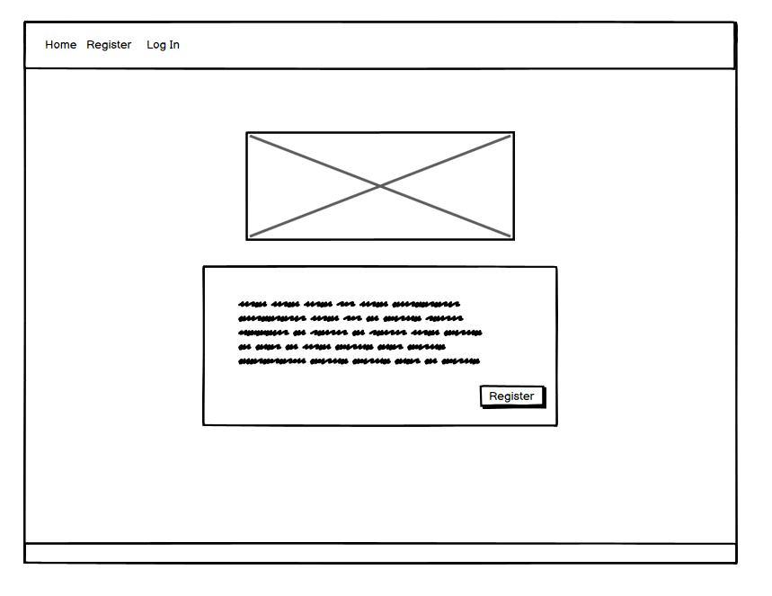
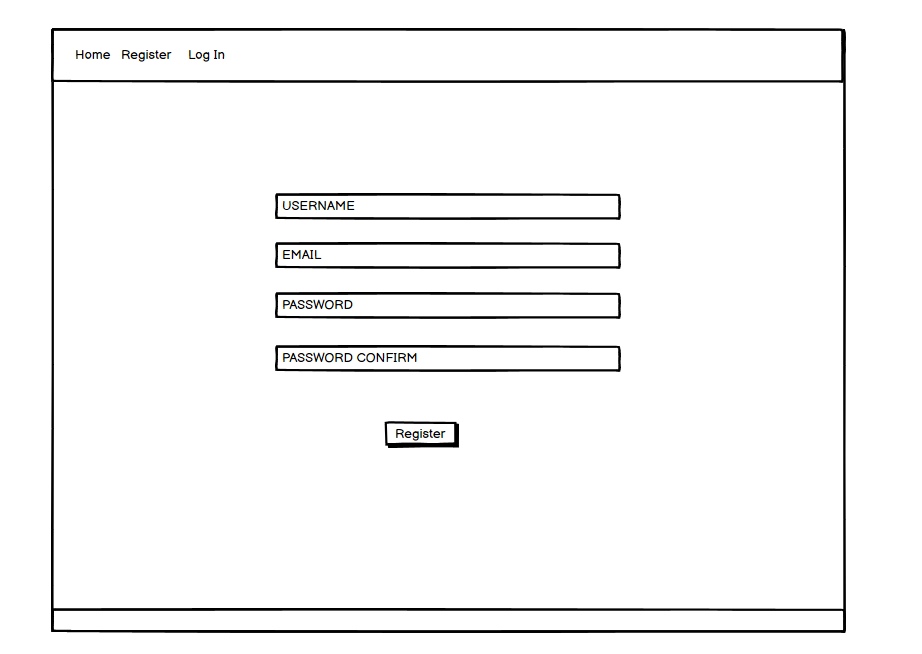
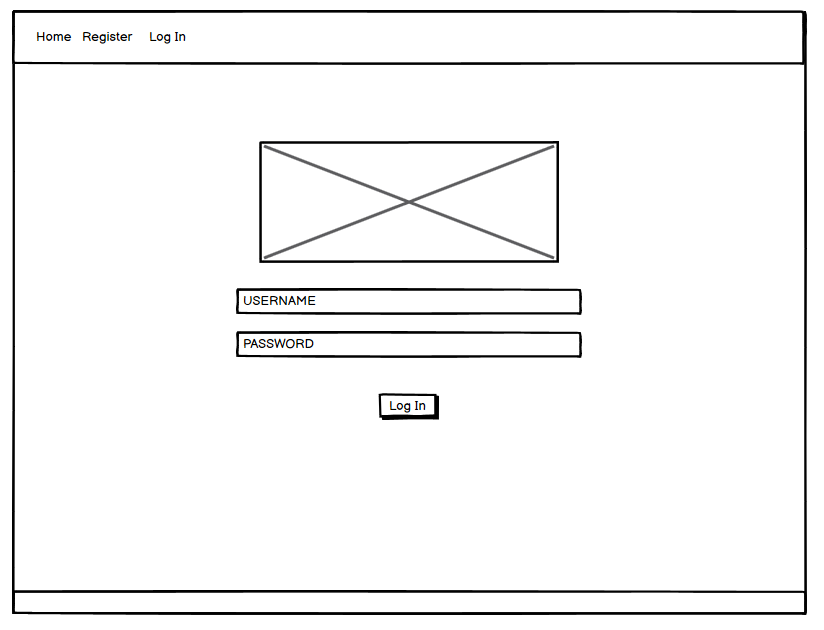
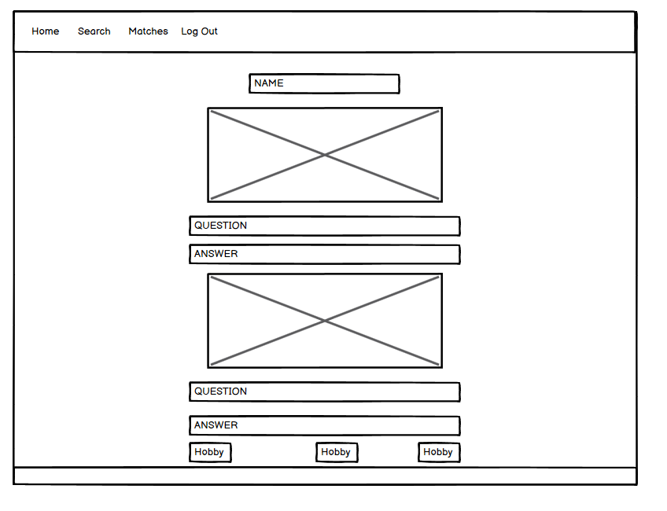

# love.exe

Link to deployed site

## Contents

## Introduction
<!-- TODO:-->

###### [*Back to contents*](#contents)

## User Experience

###### [*Back to contents*](#contents)

### Stories

###### [*Back to contents*](#contents)

#### External User Story
<!-- TODO:
-->

###### [*Back to contents*](#contents)

#### Site Owner User Story
<!-- TODO:
-->

###### [*Back to contents*](#contents)

### Strategy

#### Agile

We chose to work in sprints, encouraging an agile development pipeline, where we are able to quickly adjust and respond to challenges in the development and address any issues that may occur in a fast and efficient manner.

###### [*Back to contents*](#contents)

#### MoSCoW

We used a github project board - allowing for the use of a MoSCoW prioritisation. This allowed us to keep foccused on the tasks that were required for the projects, ensuring a timely development timeline in keeping delivering a functioning project whilst working in defined sprints.

###### [*Back to contents*](#contents)

### Scope

We wanted to create an inclusive website for matching people with desired interests and hobbies - while taking into account each users individual dealbreakers. To achieve this approach we decided that the photo of other users will be blurred until you have successfully passed the dealbreaker questions for another user - allowing for matches to be based more heavily on hobby and interest compatibilities and reducing the superficial nature matching people based solely on photos.

<!-- TODO: -->

###### [*Back to contents*](#contents)

#### Project Setup

The project was setup to use Django and Django-environ, also utilising a .env file where environment variables can be stored, which was added to the .gitignore to ensure that sensitive information is kept private

```bash
pip install Django
pip install django-environ
pip freeze > requirements.txt
django-admin startproject matching_project.
```
<!-- # echo "web: gunicorn videoGameTracker.wsgi" > Procfile -->

#### .env setup
```text
SECRET_KEY=`Sanitised_Key`
DEBUG=True
```

#### Entity Relationship Diagrams
<!-- TODO:

```plaintext
text
``` -->

### Wireframes

#### Landing Page



#### Register Page



#### Login Page



#### Logout Page



#### Edit Profile Page


TODO:

## Design


### Colour Scheme


### Imagery

TODO:
<!-- Where are user images stored
How do users upload profile pictures -->

### Typography
TODO: 


## Website Features
TODO:


## Future Features
TODO:
<!-- Is there anything we may want to add later on? -->

## Technologies Used

### HTML Language


### CSS Styling

### Terminal

### Tailwind

### Django

### Git

### GitHub

### Postgres

### Visual Studio


## Testing

### Manual / Ongoing Testing

As part of the development of the project, it was beneficial to perform our own testing before creating a pull request, this ensured that the need to go back and revisit code was kept to a minimum, helping to work more efficiently and keep the overall number of code reviews needed as low as possible.

### Validation

#### HTML

#### JavaScript

#### WAVE

#### Lighthouse

## Credits

### [Google Fonts](https://fonts.google.com)


### [Venngage](https://venngage.com/blog/accessible-colors/)

Vengage was used to create a selection of accessible colour pallets, ensuring that there was suitable contrast between the chosen colours to keep the site accessible to all users